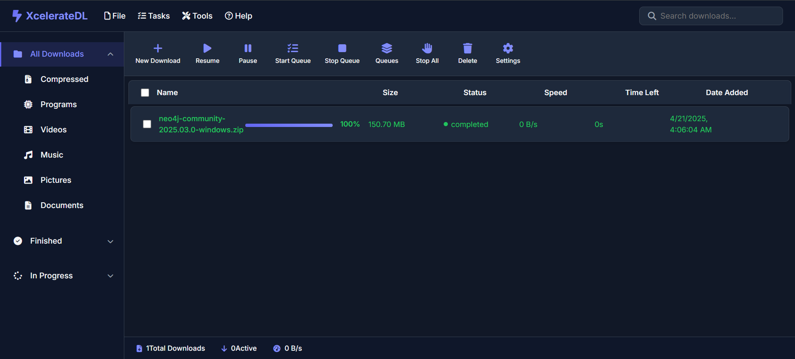

# XcelerateDL

<div align="center">
  


**A high-performance download manager with FastAPI backend and intuitive UI**

[](https://www.python.org/downloads/)
[](https://fastapi.tiangolo.com/)
[](LICENSE)

</div>

## 🚀 Features

- **⚡ Fast Downloads**: Multi-threaded, asynchronous downloading for maximum speed
- **🎥 YouTube Support**: Download videos or extract audio as MP3
- **⏯️ Flexible Control**: Pause, resume, or cancel downloads anytime
- **🔄 Real-time Updates**: Monitor download progress via WebSockets
- **📁 File Organization**: Auto-categorize downloads by file type
- **📊 Queue Management**: Prioritize downloads with pause/resume all functionality
- **💾 Persistent Storage**: Resume downloads after application restart
- **🖥️ Dual Interface**: Use the REST API or standalone GUI
- **🌐 Bandwidth Management**: Intelligent bandwidth allocation across multiple downloads
- **⏰ Download Scheduling**: Schedule downloads for specific times/dates
- **🔍 Advanced Search**: Powerful search functionality for finding downloads

## 📋 Table of Contents

- [Quick Start](#-quick-start)
- [Installation](#-installation)
- [Usage](#-usage)
  - [GUI Mode](#gui-mode)
  - [API Mode](#api-mode)
- [API Documentation](#-api-documentation)
- [Configuration](#-configuration)
- [Architecture](#-architecture)
- [Contributing](#-contributing)
- [License](#-license)

## 🚀 Quick Start

### Prerequisites

- Python 3.8+
- For YouTube downloads: ffmpeg

## 🔧 Installation

```bash
# Clone the repository
git clone https://github.com/yourusername/XcelerateDL.git
cd XcelerateDL

# Create and activate virtual environment (recommended)
python -m venv venv
# On Windows:
venv\Scripts\activate
# On macOS/Linux:
source venv/bin/activate

# Install dependencies
pip install -r requirements.txt
```

## 🖥️ Usage

XcelerateDL can be used in two modes:

### GUI Mode

For a complete desktop experience with a user-friendly interface:

```bash
python -m app.main --gui
```

### API Mode

For headless operation or integration with other applications:

```bash
# Default configuration (host: 0.0.0.0, port: 8000)
python -m app.main

# Custom host and port
python -m app.main --api-only --host 127.0.0.1 --port 8080
```

After starting in API mode, access the web interface at `http://localhost:8000` (or your custom host/port)

## 🔌 API Documentation

Once the server is running, access the interactive API documentation at:
- Swagger UI: `http://localhost:8000/docs`
- ReDoc: `http://localhost:8000/redoc`

### Adding a Download

```bash
curl -X POST http://localhost:8000/api/downloads \
  -H "Content-Type: application/json" \
  -d '{"url": "https://example.com/file.zip"}'
```

### YouTube Download

```bash
curl -X POST http://localhost:8000/api/downloads \
  -H "Content-Type: application/json" \
  -d '{"url": "https://youtube.com/watch?v=VIDEO_ID", "is_youtube": true, "youtube_type": "video"}'
```

### Scheduling a Download

```bash
curl -X POST http://localhost:8000/api/downloads \
  -H "Content-Type: application/json" \
  -d '{"url": "https://example.com/large-file.zip", "schedule": {"scheduled_time": "2023-12-31T23:00:00", "recurrence": "weekly", "days_of_week": [0, 3]}}'
```

### Managing Downloads

```bash
# List all downloads
curl http://localhost:8000/api/downloads

# Pause a download
curl -X POST http://localhost:8000/api/downloads/{download_id}/pause

# Resume a download
curl -X POST http://localhost:8000/api/downloads/{download_id}/resume

# Delete a download
curl -X DELETE http://localhost:8000/api/downloads/{download_id}

# Pause all downloads
curl -X POST http://localhost:8000/api/downloads/pause-all

# Resume all downloads
curl -X POST http://localhost:8000/api/downloads/resume-all

# Search downloads
curl -X POST http://localhost:8000/api/downloads/search \
  -H "Content-Type: application/json" \
  -d '{"query": "ubuntu", "category": "compressed", "tags": ["linux"]}'

# Update bandwidth settings
curl -X POST http://localhost:8000/api/downloads/bandwidth/settings \
  -H "Content-Type: application/json" \
  -d '{"total_bandwidth": 10485760, "allocation_mode": "priority"}'
```

## 📘 API Reference

### Endpoints

| Endpoint | Method | Description |
|----------|--------|-------------|
| `/api/downloads` | GET | List all downloads with optional filtering |
| `/api/downloads` | POST | Add a new download |
| `/api/downloads/search` | POST | Search downloads with advanced criteria |
| `/api/downloads/{id}` | GET | Get details of a specific download |
| `/api/downloads/{id}/pause` | POST | Pause a specific download |
| `/api/downloads/{id}/resume` | POST | Resume a specific download |
| `/api/downloads/{id}` | DELETE | Delete a download, with option to delete file |
| `/api/downloads/pause-all` | POST | Pause all active downloads |
| `/api/downloads/resume-all` | POST | Resume all paused downloads |
| `/api/downloads/{id}/open` | POST | Open downloaded file with default application |
| `/api/downloads/{id}/settings` | POST | Update settings for a specific download |
| `/api/downloads/{id}/schedule` | POST | Schedule a download for a specific time |
| `/api/downloads/bandwidth/settings` | GET | Get current bandwidth settings |
| `/api/downloads/bandwidth/settings` | POST | Update bandwidth settings |
| `/api/downloads/{id}/tags` | POST | Update tags for a download |

### Download Parameters

When creating a download, you can specify these parameters:

```json
{
  "url": "https://example.com/file.zip",
  "filename": "myfile.zip",  // Optional: Auto-detected if not provided
  "save_path": "/path/to/save",  // Optional: Uses default downloads folder if not specified
  "category": "compressed",  // Optional: Auto-detected based on file extension
  "is_youtube": false,  // Optional: Auto-detected from URL
  "youtube_type": "video",  // Optional: "video" or "audio"
  "priority": 2,  // Optional: 1=low, 2=normal, 3=high
  "max_speed": 1048576,  // Optional: Limit download speed in bytes/sec
  "max_retries": 3,  // Optional: Max retry attempts for failed downloads
  "schedule": {  // Optional: Schedule settings
    "scheduled_time": "2023-12-31T23:00:00",  // When to start the download
    "recurrence": "weekly",  // "daily", "weekly", or null for one-time
    "days_of_week": [0, 3],  // For weekly: 0=Monday, 6=Sunday
    "bandwidth_allocation": 30  // Optional: Percentage of bandwidth to use (0-100)
  },
  "bandwidth_allocation": 20,  // Optional: Percentage of bandwidth to allocate
  "tags": ["linux", "iso"]  // Optional: Tags for organization and search
}
```

### Status Codes

| Status | Description |
|--------|-------------|
| `queued` | Download is waiting in queue |
| `downloading` | Download is in progress |
| `paused` | Download has been paused |
| `completed` | Download has finished successfully |
| `failed` | Download encountered an error |
| `scheduled` | Download is scheduled for future |

### File Categories

| Category | Description |
|----------|-------------|
| `compressed` | ZIP, RAR, 7Z, etc. |
| `programs` | EXE, MSI, DEB, etc. |
| `videos` | MP4, MKV, AVI, etc. |
| `music` | MP3, FLAC, WAV, etc. |
| `pictures` | JPG, PNG, GIF, etc. |
| `documents` | PDF, DOCX, XLSX, etc. |
| `youtube` | YouTube videos or extracted audio |
| `other` | Files not matching other categories |

## 📊 Bandwidth Management

The bandwidth management system allows intelligent allocation of network resources:

### Allocation Modes
- **Equal**: Each download gets an equal share of available bandwidth
- **Priority**: Higher priority downloads get more bandwidth (Low=1x, Normal=2x, High=4x weight)
- **Custom**: Specify exact percentages for individual downloads

### Setting Bandwidth Limits
```json
{
  "total_bandwidth": 10485760,  // Total bandwidth in bytes/sec (10 MB/s)
  "allocation_mode": "priority",  // "equal", "priority", or "custom"
  "custom_allocations": {  // Only used in custom mode
    "download-id-1": 60,  // Percentage allocation (0-100)
    "download-id-2": 20
  }
}
```

## ⏰ Download Scheduling

Schedule downloads for specific times to better manage bandwidth usage:

### Scheduling Options
- One-time schedules (specific date and time)
- Recurring schedules (daily or weekly)
- Day-of-week selection for weekly schedules
- Per-download bandwidth allocation during scheduled times

## 🔍 Advanced Search

Use the powerful search functionality to find downloads with multiple criteria:

### Search Parameters
```json
{
  "query": "ubuntu",  // Text to search in name/url/tags
  "category": "compressed",  // Filter by category
  "status": ["completed", "failed"],  // Filter by one or more statuses
  "date_from": "2023-01-01T00:00:00",  // Filter by date range
  "date_to": "2023-12-31T23:59:59",
  "min_size": 1048576,  // Filter by size range (bytes)
  "max_size": 1073741824,
  "tags": ["linux", "iso"]  // Filter by tags
}
```

## ⚙️ Configuration

XcelerateDL's behavior can be configured through:

- **Environment Variables**: Set system-wide defaults
- **Command Line Arguments**: Override defaults for the current session
- **Settings UI**: Configure through the application interface
- **API Endpoints**: Programmatically update settings

### Configurable Settings
- Download folder location
- Maximum concurrent downloads
- Default download priorities
- Speed limits
- Global bandwidth settings

## 🏗️ Architecture

XcelerateDL follows a modern, modular architecture:

- **FastAPI Backend**: Handles HTTP requests and WebSocket connections
- **Download Manager**: Core service that manages the download queue and operations
- **WebSocket Manager**: Provides real-time updates to connected clients
- **Pydantic Models**: Ensures type validation and data integrity
- **GUI**: Built with Eel for a seamless desktop experience

### Core Components

#### Download Manager

The heart of XcelerateDL is the `DownloadManager` class which:
- Processes the download queue based on priority
- Manages file download operations using async I/O
- Handles YouTube video/audio downloading through yt-dlp
- Maintains persistent download state

#### API Layer

The FastAPI-based API provides:
- RESTful endpoints for managing downloads
- WebSocket connections for real-time updates
- Swagger documentation for easy integration
- JWT authentication for secure access

#### User Interface

XcelerateDL offers dual interfaces:
- **Web UI**: Built with modern web technologies for browser access
- **Desktop App**: Wrapped with Eel for a native-like experience

## 🤝 Contributing

Contributions are welcome! Please feel free to submit a Pull Request.

1. Fork the repository
2. Create your feature branch (`git checkout -b feature/amazing-feature`)
3. Commit your changes (`git commit -m 'Add some amazing feature'`)
4. Push to the branch (`git push origin feature/amazing-feature`)
5. Open a Pull Request

## 📄 License

This project is licensed under the MIT License - see the LICENSE file for details.

## 🙏 Acknowledgements

- [FastAPI](https://fastapi.tiangolo.com/) - For the powerful API framework
- [yt-dlp](https://github.com/yt-dlp/yt-dlp) - For YouTube download functionality
- [Eel](https://github.com/ChrisKnott/Eel) - For the GUI framework 
